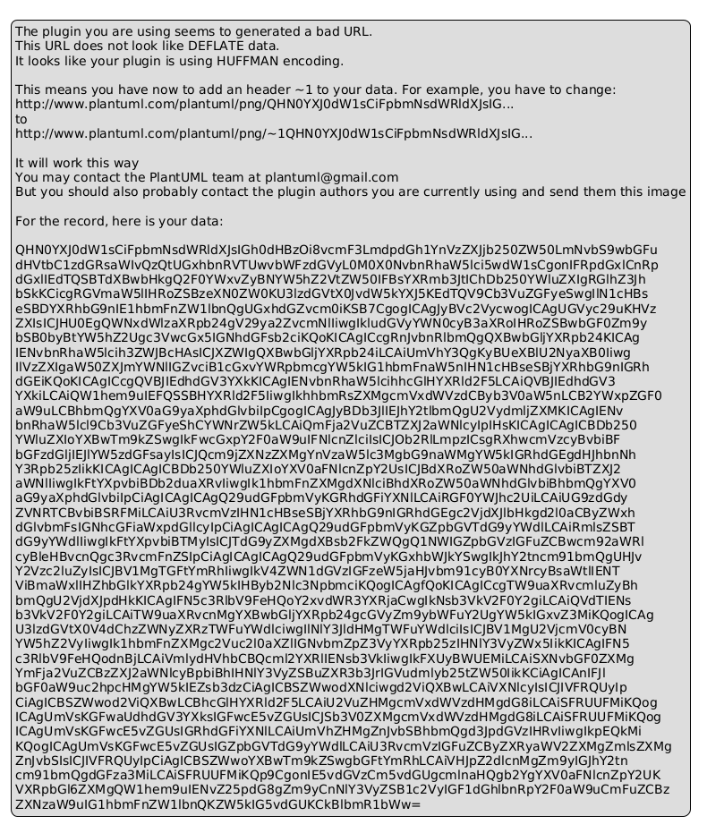

### Detailed Explanation of the Proposed Architecture

#### 1. **Frontend Architecture (React + TypeScript)**

- **Component Structure**:
  - The frontend is modular, built with React components for scalability and maintainability. Key components include:
    - **Header Component**: Manages navigation and user actions.
    - **CatalogTable Component**: Displays the product catalog with pagination, sorting, and filtering.
    - **ProductDetail Component**: Interface for viewing and editing product details.
    - **CSVUploader Component**: Facilitates CSV file uploads with drag-and-drop functionality.
    - **ExportComponent**: Allows CSV export of catalog data, integrating with backend services.

- **UI Frameworks/Component Libraries**:
  - **Material-UI (MUI)**: Provides an extensive component library for consistent design and rapid development.
  - **USWDS Components**: Ensures compliance with US federal accessibility standards.

#### 2. **Backend Architecture (Node.js + Express + PostgreSQL)**

- **RESTful API Endpoints**:
  - Structured around REST principles, with endpoints including:
    - **/api/upload**:
      - **POST**: Handles CSV uploads, validation, and storage on Amazon S3.
    - **/api/products**:
      - **GET**: Retrieves products with sorting and filtering.
      - **POST**: Adds new products.
    - **/api/products/:id**:
      - **GET**: Fetches specific product details.
      - **PUT**: Updates product details.
      - **DELETE**: Removes a product.
    - **/api/export**:
      - **GET**: Exports product data to CSV, saved on Amazon S3.

- **Data Processing Workflows**:
  - **File Handling**: Uses **Multer** for file uploads.
  - **Validations**: Ensures data integrity with **Joi**.
  - **Background Processing**: Utilizes **AWS Lambda** for tasks like CSV validation.

#### 3. **AWS Infrastructure & Deployment**

- **Hosting**:
  - **AWS Elastic Beanstalk**: Automates deployment and scaling of the Node.js app.

- **File Storage**:
  - **Amazon S3**: Stores raw and processed CSV files.

- **Database**:
  - **Amazon RDS with PostgreSQL**: Provides a scalable database solution.

- **API Management**:
  - **Amazon API Gateway**: Manages API traffic with security features.

- **Security**:
  - **Amazon Cognito**: Manages user authentication and authorization.

- **CI/CD Pipeline**:
  - **AWS CodePipeline**: Automates integration and deployment with **CodeBuild** and **CodeDeploy**.

## Simplified C4 Model

### Explanation of the Simplified C4 Model

1. **Actors and Systems**:
   - **GSA Acquisition Workforce**: Primary users managing the supply catalog.
   - **Supply Catalog Management Platform**: Central system for catalog management.
   - **GSA Advantage and FedMall**: External systems for catalog publication.

2. **Interactions**:
   - The workforce uses the platform for catalog tasks.
   - The platform publishes data to external systems for procurement.

## Generated Diagrams

